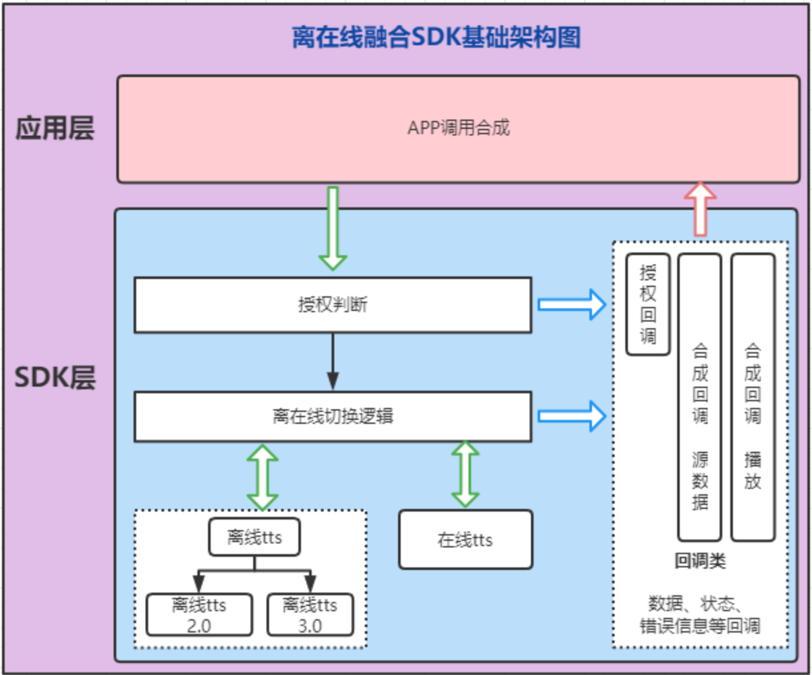

### 离在线融合SDK（Android版本）
#### 下载安装
Demo 示例地址： https://github.com/data-baker/SynthesisMixDemo
#### 项目架构及背景



我们在声音合成的业务需求中有既需要使用在线合成，也需要使用离线合成的场景。为此我 们提供此离在线融合 SDK 服务。SDK 中支持指定合成方式：

1. ONLINE：仅在线合成。
2. MIX：优先在线合成，在线合成不可用 or 失败切换至离线合成。
3. OFFLINE：仅离线合成。

SDK 第一步先进行鉴权，鉴权成功结果通过授权回调反馈给开发者。鉴权成功之后进行第二 步合成。合成的结果支持通过 SynthesisMixCallback 拿到合成的声音源数据自行处理，也支 持通过 SynthesizerMixMediaCallback 将合成后的声音数据交给 SDK 内置简易播放器进行播放 处理，各类播放状态回调及播放控制均交给开发者

#### Android Studio 集成 aar（参考 demo）

1. 集成 aar 包有多种方式，本文提供一种作为参考，采用其他正确集成方式都 可行。将 lib-base-component-release-xxx.aar 、 lib-tts-mix-release-xxx.aar 、 lib-tts-offline-release-xxxx.aar、olib-tts-online-release-xxx.aar  4 个 aar 包拷贝至 libs 目录下，并执行 下一步（2.2）。注意新增*.aar 格式。
2. 在主 module 的 build.gradle 文件里，添加以下代码

```
dependencies {
implementation fileTree(dir: 'libs', include: ['*.jar', '*.aar'])
 implementation 'com.squareup.okhttp3:okhttp:4.2.2'
 implementation 'com.google.code.gson:gson:2.8.6'
}
```

3. 在主 Module 的 AndroidManifest.xml 文件中添加网络权限。若使用离线合 成 SDK，在安卓 6.0 系统及以上版本需要动态申请写 SDK 权限。

```
<uses-permission android:name="android.permission.INTERNET" />
<uses-permission android:name="android.permission.ACCESS_NETWORK_STATE"/>
```

4. 若 私 有 化 部 署 需 要 在 主 Module 的 AndroidManifest.xml 文件中的 application 节点添加以下属性以便支持 http 请求或 ws 请求。

```
  android:usesCleartextTraffic="true"
```

5. 关于混淆

SDK 中用到了 okhttp 和 gson，所以需要将这两个包的混淆代码添加上。具 体混淆代码可以去官方文档上查阅。如果项目中已经有这两个包的混淆代码，不 必重复添加。请加上我们 SDK 其他类的混淆代码，如下：

```
#离在线合成
-keeppackagenames com.baker.tts.base.component
-keep class com.baker.tts.base.component.bean.**{*;}
-keep class com.baker.tts.base.component.callback.**{*;}

-keeppackagenames com.baker.tts.mix.lib
-keep class com.baker.tts.mix.lib.callback.**{*;}

-keeppackagenames com.baker.tts.offline
-keep class com.baker.tts.offline.bean.**{*;}
-keep class com.baker.tts.offline.callback.**{*;}

-keeppackagenames com.baker.tts.online
-keep class com.baker.tts.online.bean.**{*;}
```

#### SDK关键类

1. SynthesisMixEngine: 离在线合成关键业务处理类，全局单例。
2. SynthesisMixAuthCallback：授权相关回调类。此类会返回授权结果信息或错误 信息。
3. SynthesizerInitCallback：离线合成初始化引擎回调类。若使用离线合成功能，则 在第一步授权通过的情况下，需要调用初始化引擎方法，此回调会反馈离线引擎 初始化的结果或错误信息。
4. SynthesisMixCallback：合成结果源数据回调类。在获得合成音频源数据，或发 生错误等情况发生时会触发此回调。如果您的应用场景中需要直接处理返回的字 节类型源数据，您可以实现该类，并在回调方法中加入自己的处理逻辑。设置参 数时请将此 callback 提交给 SynthesisMixEngine 实例。
5. SynthesizerMixMediaCallback：如果想直接使用 SDK 中的播放器来处理文本合 成播放任务。您可以实现该类，此回调类中包含了播放器的各种状态回调，您可 以在这些回调方法中实现自己的其他业务逻辑。设置参数时请将此 callback 提交 给 SynthesisMixEngine 实例。
6. BakerSpeaker：离线声音资源文件对象类。SDK 支持自定义加载离线声音资源 文件，SDK 接受的参数类型为 List<BakerSpeaker>，具体请参考 demo 设置。
7. BakerBaseConstants：参数等常量类。

#### 调用说明

1. SDK 第一步是调用 SynthesisMixEngine.getInstance().firstDoAuthentication()进行鉴权操作。异步鉴权成功方可进行下一步，否则会报错。

​		鉴权需指定合成 type，及设置 clientId&secret 信息。如果仅使用在线合成 or 仅使 用离线合成，则另一组对应的信息可设置 null。

​		在线合成在此步需要进行网络请求操作，获取 token 信息。

​		设备首次使用离线合成服务，需要联网，进行服务授权激活。再次使用无需联网。 若对离线合成的音色进行升级（如增加音色），		也需要联网升级一次。

​		Mix 模式下，在线和离线鉴权逻辑都会进行，二者有其一成功，则会回调鉴权成功。


2. 若使用 Mix 模式或者 Offline 模式。 第二步需要初始化离线引擎 SynthesisMixEngine.getInstance().secondInitMixEngine()。SDK 支持自定义离线发音 人，需要将自定义的离线发音人资源准备好，在引擎调用初始化时传参给引擎（参 考 demo）。

​		离线发音人资源文件需要在[ https://ai.data-baker.com/](https://ai.data-baker.com/)平台去下载，一个发音人有 2 个资源文件，请勿修改下载的发音人资源的文		件名，否则会报错。建议是将 离线发音人资源文件动态保存在 sd 卡某目录下，将文件全路径及名字一起传参 给初始化方法。初始化		方法接受参数 List<BakerSpeaker>（参考 demo）。

​		待离线引擎初始化成功后，才可设置其余离线合成参数。

3. SDK 中提供了 2 个回调类。如果想要自己处理合成返回的字节类型源数据，则可以定义 SynthesisMixCallback 实现类。如果想直接将合成文本数据交给 SDK 中的播放器处理，则可以定义 SynthesizerMixMediaCallback 实现类。如果选择了 定义 SynthesisMixCallback 实现类，SDK 中不会执行播放器等一整套业务代码，不 用担心由此带来的各类附加资源开销。
4. 设置合成参数，如 callback、音色、音量、音速、合成文本等（参考 demo）。 Sdk 设置合成文本时支持单段不长于 200 字的文本或每段不长于 200 字的文本列 表。具体对文本分割的方法可参考 demo 中。如果文本过长会报错。
5. 调用 SynthesisMixEngine.getInstance().startSynthesis()方法开始合成服务。
6. callback 中的 onPrepared()意义是合成的第一帧数据已取得。所以您可以在此 回调方法中调用 bakerPlay()开启播放任务。
7. 在 callback 其他回调方法中按照您的业务需求实现对应逻辑。
8. 如果需要发起新的请求，可以重复第 4.4-4.7 步。
9. 在业务完全处理完毕，或者页面关闭时，调用 SynthesisMixEngine.getInstance().release();结束服务，释放资源。

注意：若使用 SDK 中播放器执行合成音频播放任务，有以下方法可调用。

- bakerPlay() 播放音频，常在 onPrepared()回调方法里调用此方法执行播放。
- bakerPause() 暂停播放。
- bakerStopPlay () 停止播放。

#### 离线声音资源文件列表

|              | **文件名称**                                                 | **备注**        |
| :----------- | :----------------------------------------------------------- | :-------------- |
| 模型前端文件 | tts_entry_1.0.0_release_front_chn_eng_ser.dat                | 所有音色用 1 份 |
| 模型后端文件 | tts_entry_1.0.0_release_back_chn_eng_hts_bb_f4180623_jm3_fix.dat | 所有音色用 1 份 |
| 贝鹤         | mix005007128_16k_DB-CN-M-11_chn21k_175k.pb.tflite.x          | 模型文件        |
|              | mg16000128_m11.pb.tflite.x                                   | 解码器          |
| 贝华         | mix005007128_16k_DB-CN-M-06_chn7k_mix2k.pb.tflite.x          | 模型文件        |
|              | mg16000128_m06.pb.tflite.x                                   | 解码器          |
| 贝菲         | mix005007128_16k_DB-CN-F-07_chn16k_mix2k_177k.pb.tflite.x    | 模型文件        |
|              | mg16000128_f07.pb.tflite.x                                   | 解码器          |
| 贝茹         | mix005007128_16k_DB-CN-F-04_chn9k_eng2k_mix2k_188k.pb.tflite.x | 模型文件        |
|              | mg16000128_f4.pb.tflite.x                                    | 解码器          |
| 贝雪         | mix005007128_16k_DB-CS-F-02_100k.tflite.x                    | 模型文件        |
|              | mg16000128_DB-CS-F-02.tflite.x                               | 解码器          |

#### 参数说明

1. 单例类 SynthesisMixEngine 基本方法及参数说明

| **方法**                  | **方法使用**             | **是否必要**               | **说明**                                                     |
| :------------------------ | :----------------------- | :------------------------- | :----------------------------------------------------------- |
| firstDoAuthentication()   | 鉴权方法                 | 是                         | Type：合成方式，支持 Online、mix、offline ttsOnlineClientId， 在线合成 clientId ttsOnlineSecret 在线合成 secret ttsOfflineClientId 离线合成 clientId， ttsOfflineSecret 离线合成 secret， SynthesisMixAuthCallback authCallback 授权回调 |
| secondInitMixEngine       | 初始化离线引擎           | 需要使用离线合成则必须调用 | frontFilePath 发音人资源前端文件路径数组， backFilePath 发音人后端资源文件路径数组， List<BakerSpeaker> speakers 发音人资源， SynthesizerInitCallback initCallback 离线引起初始化 结果回调 |
| setSynthesizerCallback    | 设置合成回调             | 是                         | 支持 SynthesisMixCallback 或 SynthesizerMixMediaCallback     |
| setVoiceNameOnline        | 设置在线合成发音人       | 是                         | 发音人列表详见 https://ai.data-baker.com/                    |
| setOnLineConnectTimeOut   | 设置在线合成连接超时时间 | 否                         | 设置在线合成超时时间，单位 s。 在线合成超时失败，切换离线合成会根据这个超时时间来判断 |
| setVoiceNameOffline3      | 设置离线合成发音人       | 否                         | 传入自定义发音人列表的 index，如 0，1，2。注：该方法已过时，建议使用setOfflineVoiceName |
| setSpeed                  | 语速                     | 否                         | 设置播放的语速，在 0～9 之间（只支持整型值），不传时默认为 5 |
| setVolume                 | 音量                     | 否                         | 设置播放的语速，在 0～9 之间（只支持整型值），不传时默认为 5 |
| setCacheSize              | 设置待播放缓存大小       | 否                         | 合成后待播放数据是放在队列中的，我们支持设置此缓存队列 size，以便控制应用内存耗费。 |
| startSynthesis            | 开启合成                 | 是                         | 支持单段文本或文本列表                                       |
| cancelSynthesis           | 取消合成                 | 否                         | 取消合成                                                     |
| bakerPlay                 | 播放音频                 | 否                         | 若使用 sdk 内置播放器，在开启合成后可调用此方法开启播放。    |
| bakerPause                | 暂停播放                 | 否                         | 暂停播放                                                     |
| bakerStopPlay             | 停止播放                 | 否                         | 停止播放会取消当前合成，停止播放并清除已缓存待播放数据。     |
| release                   | 释放服务及引擎资源       | 是                         | 在确认不再使用合成服务 or 页面销毁时调用此方法。             |
| setPitch                  | 音调（音高）             | 否                         | 设置合成的音调，在 0～9 之间（只支持整型值），不传时默认为 5 |
| setOfflineVoiceName       | 设置离线合成发音人（新） | 否                         | 设置离线合成发音人（新），传入音色别名，setVoiceNameOffline3已过时 |
| enableSubtitles           | 是否开启字级别时间戳     | 否                         | 是否开启字级别时间戳                                         |
| unInstallModel            | 卸载离线模型             | 否                         | 卸载离线模型，只支持动态加载的                               |
| loadModel                 | 加载离线模型             | 否                         | 动态加载离线模型                                             |
| isModelLoad               | 判断音色模型是否加载     | 否                         | 判断音色模型是否加载                                         |
| isRefreshOfflineAuthorize | 刷新离线授权             | 否                         | 刷新离线授权                                                 |
| refreshFrontFile          | 刷新离线前端模型文件     | 否                         | 刷新加载离线前端模型文件                                     |
| setLanguage               | 设置合成语言             | 否                         | 默认语言为中英混                                             |

1. SynthesisMixAuthCallback 回调类方法说明

| **参数**  | **参数名称** | **说明**                                                     |
| :-------- | :----------- | :----------------------------------------------------------- |
| onSuccess | 授权成功     | 此方法会返回授权成功的类型。如果时 mix 类型，则离线和在线授权均成功。 |
| onFailed  | 授权失败     | 授权失败及错误信息                                           |

1. SynthesizerInitCallback 回调类方法说明

| **参数**  | **参数名称**           | **说明**                                 |
| :-------- | :--------------------- | :--------------------------------------- |
| onSuccess | 离线合成引擎初始化成功 | 此方法会返回代表离线合成引擎初始化成功。 |
| onFailed  | 离线合成引擎初始化失败 | 离线合成引擎初始化失败及相关错误信息     |

1. SynthesisMixCallback 回调类方法说明

| **参数**             | **参数名称**               | **说明**                                                     |
| :------------------- | :------------------------- | :----------------------------------------------------------- |
| onSynthesisStarted   | 开始合成                   | 此方法会返回授权成功的类型。如果时 mix 类型，则离线和在线授权均成功。 |
| onPrepared           | 准备就绪                   | 第一帧数据返回时的回调，此时可以使用数据执行播放。           |
| onBinaryReceived     | 流式持续返回数据的接口回调 | data 合成的音频数据。 interval 音频 interval 信息，可能为空。 interval 音频 interval 信息，可能为空，可忽略。 endFlag 是否时最后一个数据块，false：否，true：是。intervals：字级别时间戳 |
| onSynthesisCompleted | 合成完成。                 | 当 onBinaryReceived 方法中 endFlag 参数=true，即最后一条 消息返回后，会回调此方法。 |
| onWarning            | 预警信息                   | 部分不影响合成的错误会以警示信息方式回调                     |
| onTaskFailed         | 合成失败                   | 返 回 msg 内 容 格 式 为 ： {"code":40000，"message":"…"，"trace_id":" 1572234229176271"}  trace_id 是引擎内部合成任务 ID。 |

1. SynthesizerMixMediaCallback 回调类方法说明

| **参数**     | **参数名称**       | **说明**                                                     |
| :----------- | :----------------- | :----------------------------------------------------------- |
| playing      | 开始播放回调       | 播放状态切换：开始播放时的回调。                             |
| noPlay       | 暂停或停止播放回调 | 播放状态切换：暂停或停止播放时的回调。                       |
| onCompletion | 播放结束           | 当数据播放完成时的回调。                                     |
| onWarning    | 预警信息           | 部分不影响合成和播放的错误会以警示信息方式回调               |
| onError      | 各类失败时的回调   | 返 回 msg 内 容 格 式 为 ：{"code":40000，"message":"…"，"trace_id":" 1572234229176271"}trace_id 是引擎内部合成任务 ID。 |

**失败时返回的 code 对应表**

| **错误码** | **含义**                                                     |
| :--------- | :----------------------------------------------------------- |
| 23180001   | 在线合成，token 过期                                         |
| 23180002   | 在线合成发音人参数错误                                       |
| 23180003   | 在线合成文本内容转码错误                                     |
| 23180004   | 在线合成返回结果解析错误；返回 null                          |
| 23180005   | 在线合成返回结果解析错误                                     |
| 23180006   | 在线合成失败，失败信息相关错误                               |
| 23180007   | 接口函数调用成功                                             |
| 23180008   | 授权相关错误                                                 |
| 23180009   | 离线 SDK 初始化（设置资源）相关错误                          |
| 23180010   | 离线合成文本内容为空                                         |
| 23180011   | 传入文本过长                                                 |
| 23180012   | 离线参数格式错误                                             |
| 23180013   | 离线引擎没有初始化                                           |
| 23180014   | 离线合成未知错误                                             |
| 23180015   | 引擎内部错误（离线合成引擎默认错误码）                       |
| 23180016   | 离线引擎内部错误                                             |
| 23180017   | 引擎忙                                                       |
| 23180018   | 内存不足                                                     |
| 23180019   | 引擎运行时错误                                               |
| 23180020   | 同线程的接口函数被多次调用（同线程的不同接口函数不能同时被调用） |
| 23180021   | 播放器相关错误                                               |
| 23180022   | 离线合成模型文件错误                                         |
| 23180023   | 离线合成模型资源匹配错误                                     |
| 23180024   | 释放离线合成 SDK 错误                                        |
| 23180025   | 离线动态加载模型失败                                         |
| 23180026   | 获取离线发音人失败                                           |
| 23180027   | 离线TTS线程被占用                                            |
